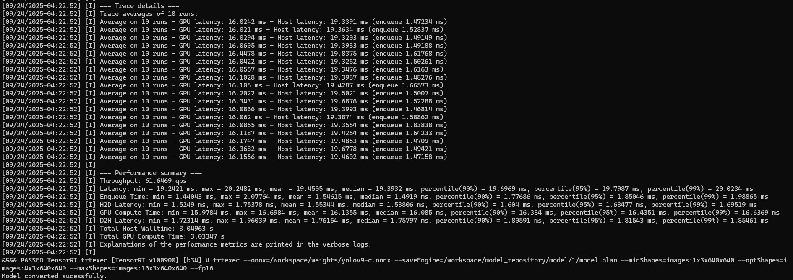
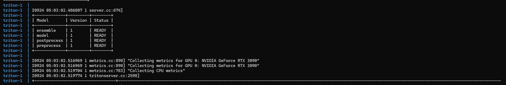
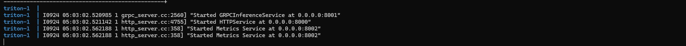
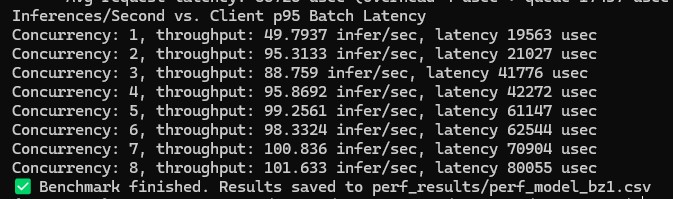

# Example deploy YoloV9 Model

This example demonstrates how to convert a YoloV9 ONNX model to a Triton Inference Server engine. The ensemble model includes an image preprocessing, NMS postprocessing and TensorRT model to do inference.

---

## Quick Start

**1. Prepare Model**

Download [YoloV9-C ONNX](https://github.com/odlab-ai/odlab-triton/releases/download/v0.0.1/yolov9-c.onnx) model and puts in `weights/`:

```
weights/
└── yolov9-c.onnx
```

**2. Create the Model Repository**

In this tutorial, the `model_repository` already includes an implemented YoloV9 ensemble consisting of image preprocessing, NMS postprocessing, and a TensorRT inference model.


**3. Convert ONNX to TensorRT**

Use `scripts/onnx2trt.sh` to convert ONNX to TensorRT engine. The input width and height are fixed at `640x640`. To enable dynamic batching, configure the minimum, optimized, and maximum batch sizes using the following environment variables in `onnx2trt.sh`:
```bash
# Version of the engine to convert
VERSION=1                        

# Input tensor size (Channels x Height x Width)
INPUT_SIZE=3x640x640             

# Dynamic batching settings
MIN_BZ=1        # Minimum batch size
OPT_BZ=4        # Optimized batch size
MAX_BZ=16       # Maximum batch size
```

The generated TensorRT engine will support batch sizes in the range `[MIN_BZ, MAX_BZ]` and will be optimized for OPT_BZ for best inference performance.

```bash
docker run --rm -it --gpus all \
  -v $(pwd)/weights:/workspace/weights \
  -v $(pwd)/model_repository:/workspace/model_repository \
  -v $(pwd)/scripts:/workspace/scripts \
  nvcr.io/nvidia/tensorrt:25.04-py3 \
  /bin/bash -c "pip install --no-cache-dir onnx && bash /workspace/scripts/onnx2trt.sh"
```
Result of the YoloV9 engine:

**4. Configure Model Repository**

- Setup environment
    ```
    conda create -n odlab-env python==3.11 -y
    conda activate odlab-env

    pip install onnx Jinja2
    ```

- Model configuration files in `model_repository/` are automatically generated.  
    ```bash
    python scripts/generate_config.py weights/yolov9-c.onnx model_repository/model
    ```

**5. Environment Variables**

Create a `.env` file in the root:

```env
IMAGE_NAME=odlab-triton-detection
IMAGE_VERSION=latest
```

**6. Deploy Triton Inference Server**

Build and run using `Docker.triton` and docker-compose:

```bash
docker-compose up --build -d
```

After startup, Triton will be accessible on the following ports:

| Port | Protocol |
|------|----------|
| 8068 | HTTP     |
| 8069 | gRPC     |
| 8070 | Metrics  |

Triton server deployed successfully and models are ready:



**7. Benchmark with `perf_analyzer`**
Install perf_analyzer
[recommended method](https://github.com/triton-inference-server/perf_analyzer/blob/main/docs/install.md) or simply install via
`pip install perf-analyzer`
and run the performance analyzer:
```bash
MODEL_NAME=ensemble
TRITON_GRPC=<ip_host>:8069
OUTPUT_DIR=perf_results
NAME=perf_model_bz1

mkdir -p $OUTPUT_DIR

docker run --rm -it \
--gpus all \
-v $(pwd)/model_repository:/models \
-v $(pwd)/$OUTPUT_DIR:/perf_results \
nvcr.io/nvidia/tritonserver:25.04-py3-sdk \
perf_analyzer \
    -m $MODEL_NAME \
    -u $TRITON_GRPC \
    -i grpc \
    -b 1 \
    --percentile=95 \
    --concurrency-range 1:8 \
    --shape INPUT:640,640,3 \
    --input-data random \
    --measurement-interval 5000 \
    --verbose-csv \
    -f /perf_results/$NAME.csv

echo "Benchmark finished. Results saved to $OUTPUT_DIR/$NAME.csv"
```

Output CSV provides detailed performance metrics including latency and throughput.

---

### Notes
- Performance testing was conducted on an **NVIDIA RTX 3090** GPU.
- Results of `perf_analyzer` may vary depending on GPU model and system configuration.
